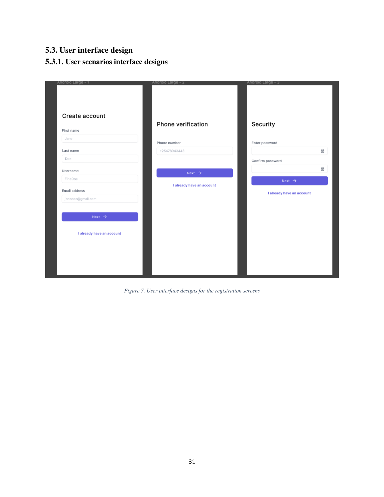

# Onboarding

This folder describes the registration flow: a three-step sequence that takes a new user from a blank app to an authenticated session.

Each step is a full screen with its own title, a form, a primary **Next** action, and a secondary **I already have an account** link that exits the flow into sign-in. No bottom navigation is shown during onboarding — the user is funnelled through the three steps before reaching the main app.

## Children

- [00-create-account.md](00-create-account.md) — first step: identity fields (names, username, email).
- [01-phone-verification.md](01-phone-verification.md) — second step: phone number entry.
- [02-security.md](02-security.md) — third step: password and confirmation.

The flow's auth contract lives in `docs/architecture/08-authentication/index.md`; this folder only describes the screens. Email/password is one of two paths into the app — Google OAuth bypasses these screens entirely, as documented in `docs/architecture/08-authentication/01-google-oauth.md`.
