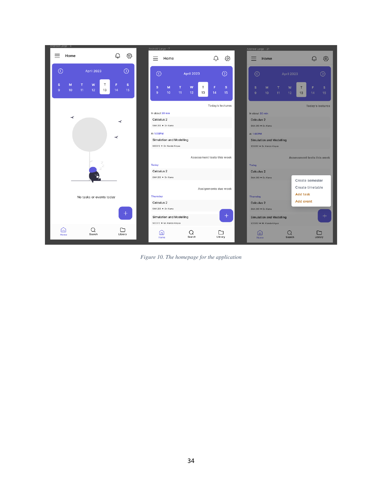

# Home

This folder describes the Home tab — the default destination after sign-in and the app's daily dashboard.

The screen is framed by the global app bar (menu, title **Home**, bell, gear) at the top and the three-tab bottom navigation (Home, Search, Library) at the bottom. Between them sits a fixed **calendar strip** that lets the user move forward and backward through a week, and a scrollable body that changes by selected date. A **floating action button** in the bottom-right corner expands a four-option create menu.

## Children

- [00-empty-state.md](00-empty-state.md) — what the body looks like when the selected date has nothing scheduled.
- [01-populated.md](01-populated.md) — the three content sections that render when a date has activity.
- [02-fab-menu.md](02-fab-menu.md) — the four create entry points the FAB exposes.

The notification bell in the app bar opens the feed described in `docs/product/06-notifications/index.md`. The data behind each section is enumerated in `docs/product/03-features.md`.
