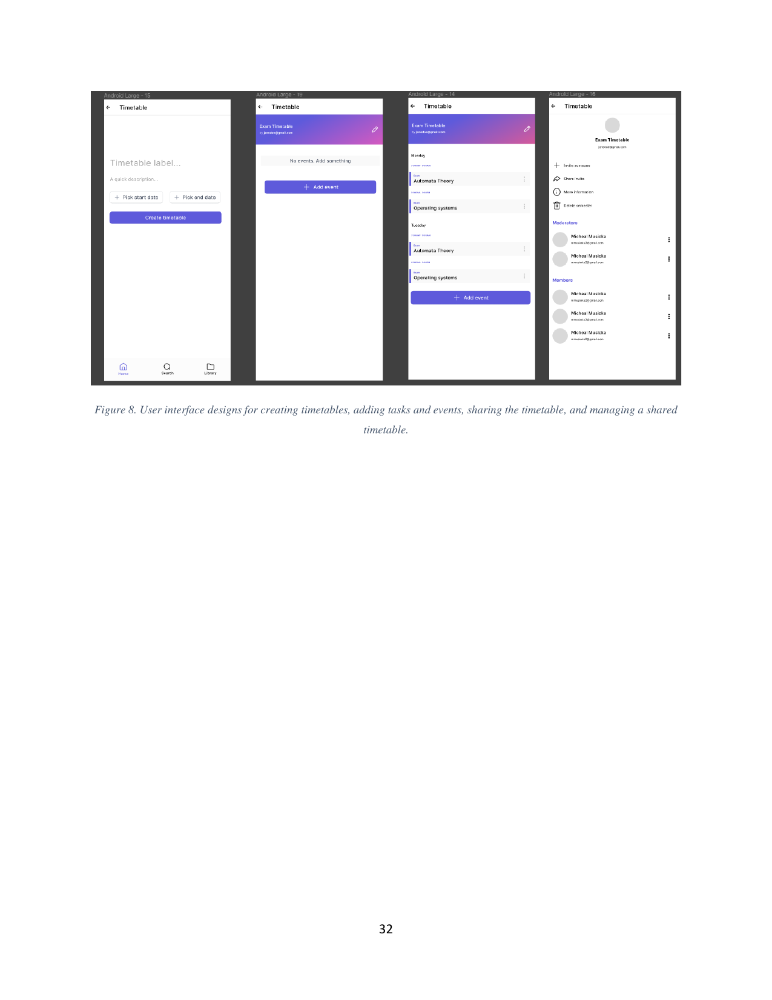

# Timetable

This folder describes the screens for creating, viewing, and managing a timetable.

A timetable is a named collection of recurring or one-off events, optionally shared with other users. Across all timetable screens the global app bar appears at the top with the back arrow and the title **Timetable**; the three-tab bottom navigation persists at the foot of the screen.

## Children

- [00-create.md](00-create.md) — the create form: label, optional description, start and end dates.
- [01-view.md](01-view.md) — the populated detail view, including the empty-state variant.
- [02-share-and-manage.md](02-share-and-manage.md) — the management surface: invite, share invite, more info, delete, plus the moderators and members lists.

The underlying entity is documented in `docs/product/05-domain-model/05-timetable.md`. Sharing semantics — ownership, moderators, members — are described in `docs/architecture/11-sharing-and-permissions/index.md`.
