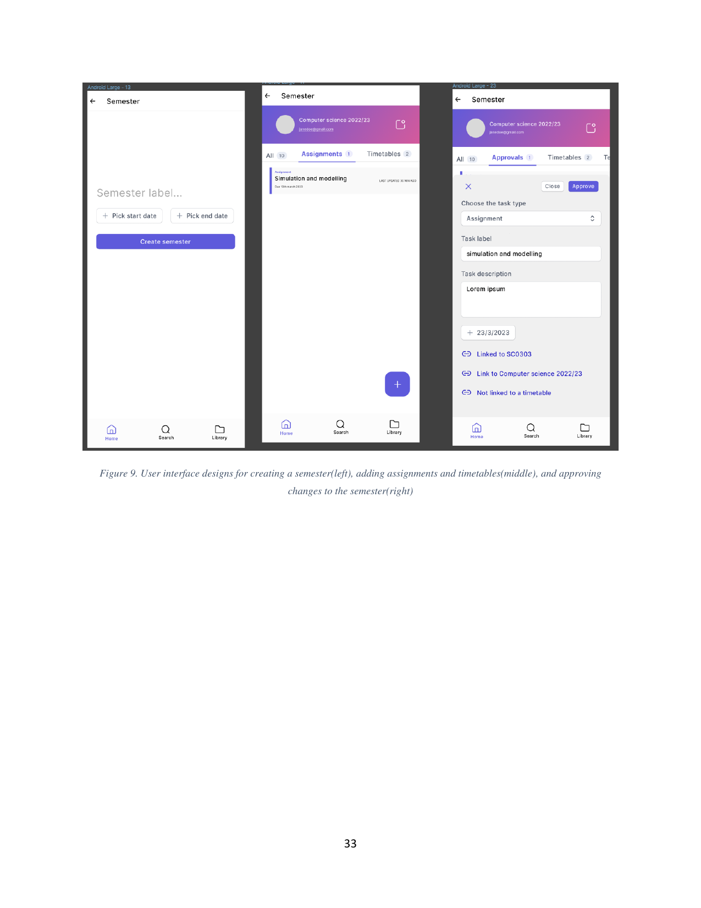

# Semester

This folder describes the screens for creating and working with a semester — the top-level container that groups a user's units, timetables, and assignments for a given academic period.

Across all semester screens the global app bar appears at the top with a back arrow and the title **Semester**; the three-tab bottom navigation persists at the foot of the screen.

## Children

- [00-create.md](00-create.md) — the create form: label, start and end dates.
- [01-tabs.md](01-tabs.md) — the detail view's local tab strip (**All**, **Assignments**, **Timetables**) and its FAB.
- [02-approvals.md](02-approvals.md) — the **Approvals** tab and the approve/close interaction for proposed changes.

The underlying entity is documented in `docs/product/05-domain-model/02-semester.md`. The approval flow is governed by `docs/architecture/11-sharing-and-permissions/03-approval-flow.md`, and the resulting notifications are described in `docs/product/06-notifications/02-event-based.md`.
