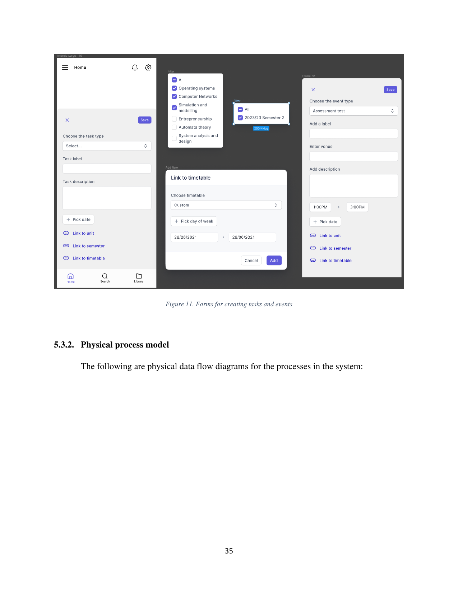

# Forms

This folder describes the shared modal forms used throughout the app to add or edit tasks and events, to filter list content, and to link a resource to a timetable.

Forms appear as overlays on top of the underlying screen rather than as full-screen routes. Each form carries a leading dismiss affordance and a trailing primary action (typically **Save**), with its body laid out as a vertical stack of labelled fields. The bottom navigation remains visible beneath the modal so the user retains a sense of context.

## Children

- [00-task-form.md](00-task-form.md) — the form for creating or editing a task.
- [01-event-form.md](01-event-form.md) — the form for creating or editing an event.
- [02-filters.md](02-filters.md) — the multi-select chip filter used by list surfaces.
- [03-link-to-timetable.md](03-link-to-timetable.md) — the sub-modal for linking a task or event to a timetable.

The underlying entities are documented in `docs/product/05-domain-model/06-task.md` and `docs/product/05-domain-model/07-event.md`. The way these forms hand off to the network layer is described in `docs/architecture/04-network-and-graphql/index.md`.
